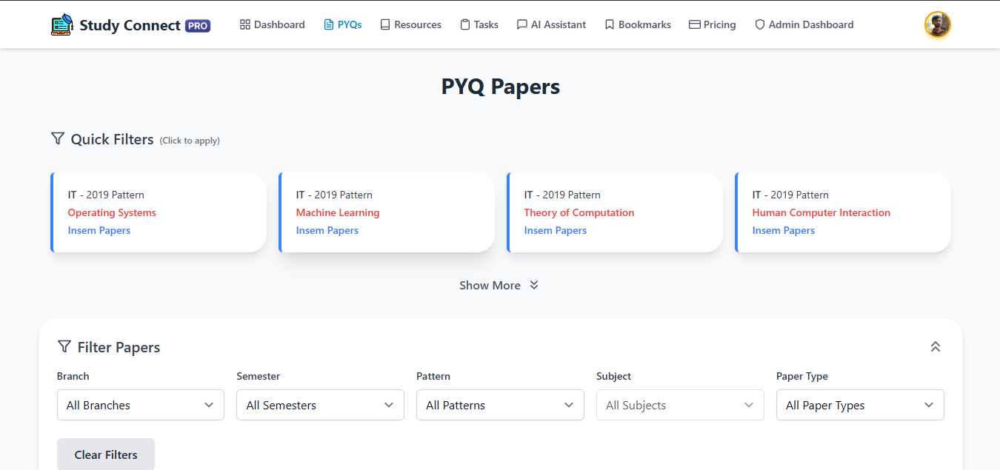
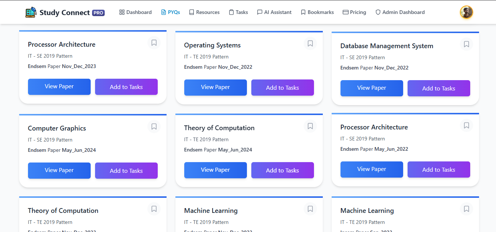
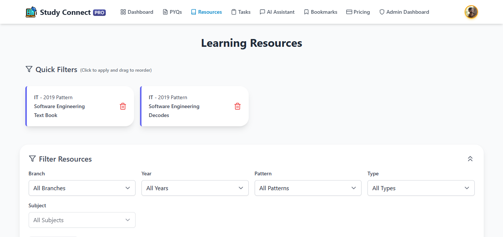
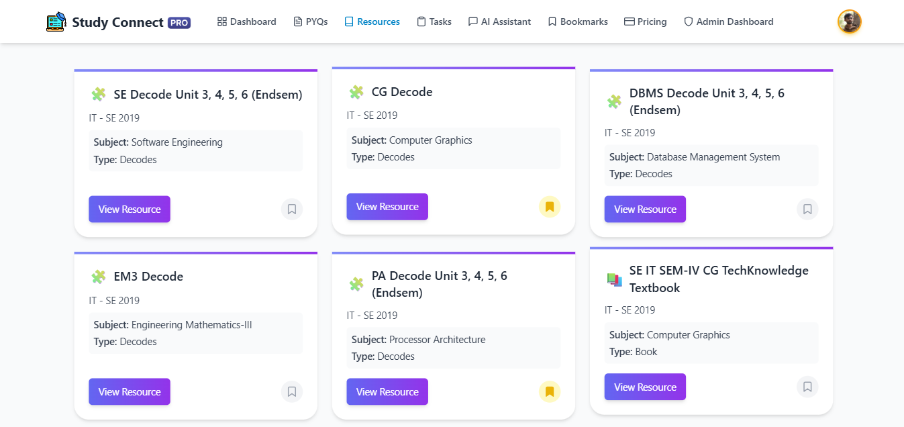
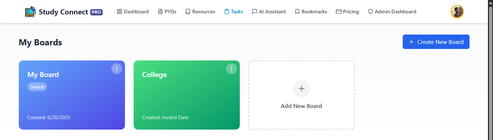
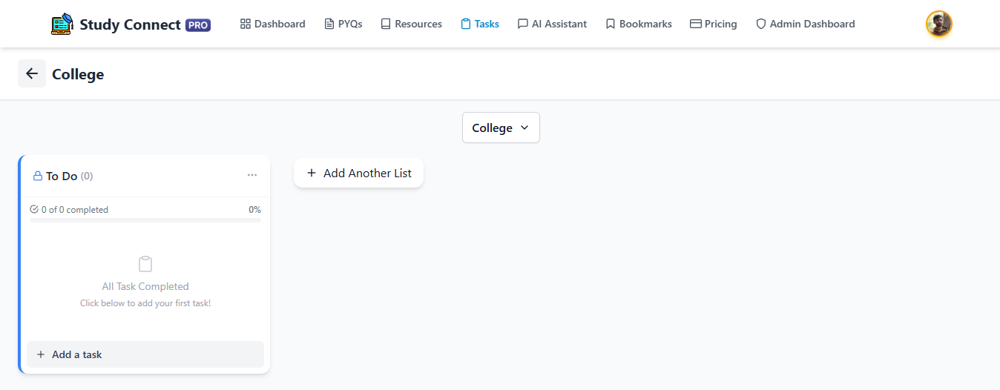
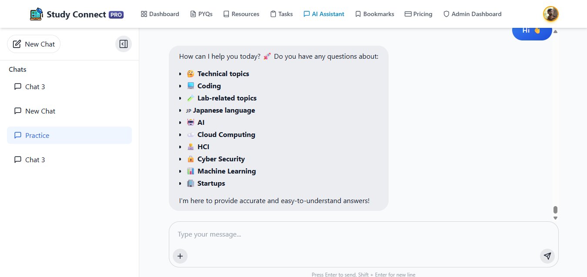

# 🎓 Study Connect

**The Ultimate Academic Companion for SPPU Engineering Students**  
Built with ❤️ using React, TypeScript, Firebase, and Gemini AI

---

## 🚀 Features

### 📚 1. SPPU Past Year Papers Repository
- Filter papers by Subject, Branch, Year, and Semester
- Bookmark important papers
- Add papers to your Task Board
---

### 📘 2. Study Resources Library
- Curated study materials (books, notes, videos, decodes)
- Filter and Bookmark relevant resources
---

### ✅ 3. Trello-like Task Management Board
- Create custom task boards (2 Free, 5 for Premium users)
- Add any past year paper directly as a task
- Track progress with intuitive drag & drop
---

### 🔖 4. Bookmark Manager
- Easily access all your saved Papers and Resources
- Quick links to view/download/bookmarked items
---

### 🤖 5. RAG-Powered AI Study Assistant
> _Context-aware academic support using the latest Generative AI_

- Ask any syllabus or subject-related questions
- Powered by Gemini AI + SPPU syllabus, resources, and papers
- Dynamic response generation with full context
---

## 🆓 Free vs 🔐 Premium Access

| Feature                   | Free User     | Premium User     |
|---------------------------|---------------|------------------|
| AI Chat Sessions / Day    | 2             | 10               |
| AI Prompts / Day          | 10            | 50               |
| Task Boards               | 2             | 5                |
| Bookmarks                 | ✅             | ✅                |
| Past Year Papers          | ✅             | ✅                |
| Study Resources           | ✅             | ✅                |

> 💳 **Premium subscription** is available via **Razorpay**.  
> 🔁 Webhooks ensure real-time role upgrade after payment.

---

## ⚙️ Tech Stack

### 🌐 Frontend
- React (TypeScript)
- Redux Toolkit
- Tailwind CSS
- Framer Motion (for animations)
- Firebase Authentication & Firestore

### 🧠 AI Backend (RAG Pipeline)
- Express.js (REST API)
- AstraDB (DataStax) – for Vector Search & Semantic Embeddings
- Gemini 2.0 Flash – for accurate context-aware LLM responses
- Razorpay Webhook – for Subscription Role Management

## 🖼️ Screenshots

### 📄 Papers View  

---

### 📘 Study Resources  

---

### ✅ Task Board  

---

### 🔖 Bookmarks  

---

### 🤖 AI Assistant  

## 📞 Contact & Support

Having questions or need help?

- 📧 **Email:** [alizaidshaikh9975@gmail.com](mailto:support@studyconnect.ai)  
- 🌐 **Website:** https://studyconnect.live
- 🌐 **Developer Portfolio:** https://devalizaid.me
---

Made with ❤️ by Engineering Students, for Engineering Students.
